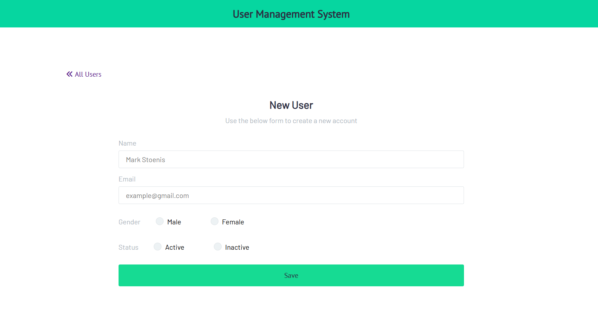
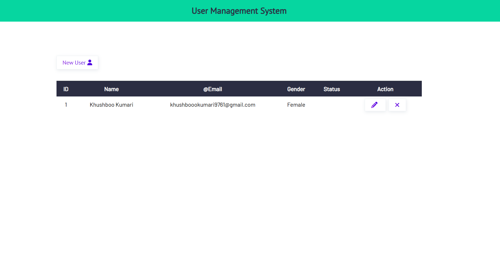

-
-
# User Management System Using Express, MongoDB & EJS

A simple and efficient User Management System that demonstrates CRUD operations (Create, Read, Update, Delete) built with Node.js, Express, MongoDB, and EJS. This project demonstrates the implementation of basic CRUD operations for user data, organized in a Model-View-Controller (MVC) architecture. It includes features like environment variable configuration, code organization, and client-side components for enhanced functionality.


## Table of Contents

- [Features](#features)
- [Technologies Used](#technologies-used)
- [Installation](#installation)
- [Usage](#usage)
- [Contributing](#contributing)


## Features

- **Create:** Add new users with name, email, gender, and status.
- **Read:** View a list of all users and details of individual users.
- **Update:** Modify user information such as name, email, gender, and status.
- **Delete:** Remove users from the system.

- Create, Read, Update, and Delete user records.
- User-friendly interface with EJS templating.
- MongoDB integration for efficient data storage.
- Organized code structure with Express and MVC architecture.
- Responsive design for a seamless user experience.


## Technologies Used

- Node.js
- Express.js
- MongoDB
- EJS (Embedded JavaScript) for views
- HTML, CSS (with a responsive design), JavaScript
- Morgan for request logging
- Nodemon for automatic server restarts during development
- Axios for handling HTTP requests
- jQuery for client-side scripting

  
## Installation

1. **Clone the repository:**

   ```bash
     git clone https://github.com/onkaryemul/User-Management-System-Using-Express-MongoDB-EJS.git
   ```

2. **Navigate to the project directory:**

   ```bash
     cd User-Management-System-Using-Express-MongoDB-EJS
   ```

3. **Install dependencies:**
   
   ```bash
     npm install
   ```


## Usage

1. **Set up environment variables:**
   Set up MongoDB: Please make sure you have a MongoDB instance running and update the connection string in the .env file.
   Create a config.env file in the root directory with the following content:

   ```env
     PORT=3001
     MONGO_URI=your-mongodb-atlas-uri
   ```

   Replace `your-mongodb-atlas-uri` with your actual MongoDB Atlas connection URL.
   Make sure to replace placeholders like `yourusername` and `yourpassword` in the MongoDB URI with your actual MongoDB credentials.

2. **Start the application:**
   Open the terminal in the root directory and start the development server using the below command:

   ```bash
     nodemon server.js
   ```
   
3. **Open your web browser and navigate to [http://localhost:3001](http://localhost:3001) to access the application.**

4. **Explore and access the User Management System through the provided routes.**

5. **Create, view, update, and delete user records using the intuitive interface.**


## Contributing

Contributions are welcome! If you have ideas for improvements or find any issues, feel free to open an issue or create a pull request.
